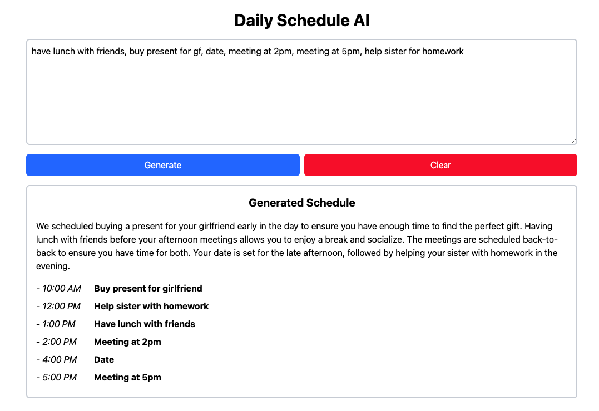

# Daily Schedule AI

This project is a simple AI-powered scheduling assistant that helps you organize your daily tasks efficiently. By leveraging OpenAI's GPT-3.5 model, it generates an optimized schedule based on your input tasks, taking into account any specific time constraints you provide.



## Features

- Natural language input for tasks and time preferences
- AI-powered schedule generation and optimization
- Responsive web interface built with React and Tailwind CSS
- Clear reasoning provided for the generated schedule
- Easy-to-read schedule output with times and tasks

## How It Works

1. Enter your tasks for the day in plain text
2. Specify any time constraints if needed (e.g., "meeting at 2pm")
3. Click "Generate" to get an AI-optimized schedule
4. View the schedule along with the AI's reasoning for the task arrangement

## Technologies Used

- React
- TypeScript
- Tailwind CSS
- OpenAI API (GPT-3.5)
- Vite

## How to Run

1. Clone the repository:
   ```bash
   git clone https://github.com/yourusername/daily-schedule-ai.git
   cd daily-schedule-ai
   ```

2. Install dependencies:
   ```bash
   npm install
   ```

3. Create a `.env` file in the root directory and add your OpenAI API key:
   ```bash
   VITE_OPENAI_API_KEY=your_api_key_here
   ```

4. Start the development server:
   ```bash
   npm run dev
   ```

5. Open your browser and navigate to `http://localhost:5173`
